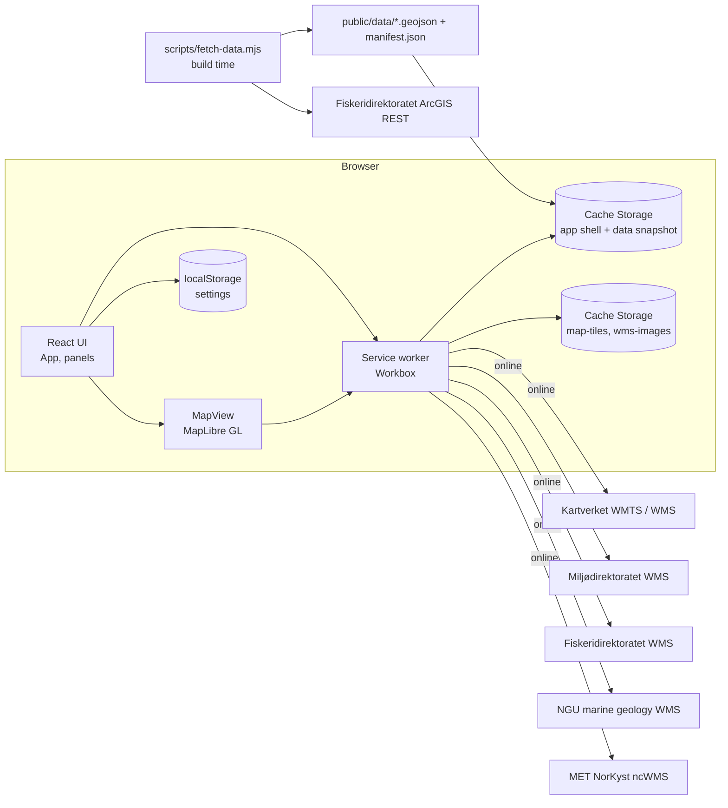
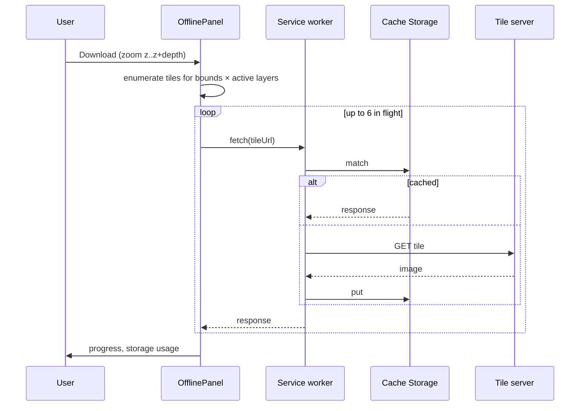

# AiMar architecture

_Updated 2026-09-13 (evening) — Phase 1 (offline-first PWA, no backend)_

## Overview

Phase 1 is a static web application. The browser talks directly to open
Norwegian map services; datasets that the browser cannot reach (no CORS or
token required) are snapshotted at build time and bundled with the app. A
service worker makes the app shell, bundled data and every viewed tile
available offline.

## Source layout (`web/src`)

| File | Responsibility |
|---|---|
| `main.tsx` | Boots React, points MapLibre at its bundled worker |
| `App.tsx` | Layout: header tabs, map, side panel, update toast |
| `components/MapView.tsx` | Builds a MapLibre style from the layer registry + settings, click/hover handling, persists view |
| `components/LayerPanel.tsx` | Base-map radio, overlay checkboxes, legend, provenance per layer |
| `components/InspectPanel.tsx` | Locality register entry, or hypothetical-site neighbourhood summary |
| `components/OfflinePanel.tsx` | Online state, install button, storage usage, area download, cache clearing, data snapshot provenance |
| `components/HelpPanel.tsx` | In-app help |
| `components/UpdatePrompt.tsx` | "New version" / "ready offline" toast via `virtual:pwa-register/react` |
| `lib/layers.ts` | **Layer registry**: id, kind (xyz / wms / geojson), URL, organisation, licence, attribution, cache policy |
| `lib/settings.ts` | `localStorage`-backed settings store exposed through `useSyncExternalStore` |
| `lib/localities.ts` | Locality types, data loader, haversine neighbourhood features |
| `lib/offline.ts` | Online hook, tile enumeration for a bounding box, prefetch with concurrency, storage estimate, cache clearing |
| `lib/install.ts` | Captures `beforeinstallprompt` |
| `lib/__tests__/` | Vitest unit tests for tile maths, neighbourhood features and the settings store |

## Storage model

| Data | Store | Written by | Policy |
|---|---|---|---|
| App shell (JS/CSS/HTML/icons) and `public/data/*` | Workbox precache | Service worker install | Versioned per build; new version prompts reload |
| Kartverket tiles | Cache Storage `map-tiles` | Service worker runtime caching | Cache-first, 20 000 entries / 180 days |
| WMS images (Kartverket, Miljødirektoratet, Fiskeridirektoratet, NGU) | Cache Storage `wms-images` | Service worker runtime caching | Cache-first, 10 000 entries / 60 days |
| NorKyst forecast images (MET thredds) | Cache Storage `forecast-images` | Service worker runtime caching | Cache-first, 3 000 entries / 1 day |
| Settings | `localStorage` key `aimar.settings.v1` | `lib/settings.ts` | Never evicted with caches |
| Per-site time series (future) | IndexedDB | Phase 2 | Per locality, explicit refresh |

The "Download this area" action simply fetches every tile URL for the active
layers over the current bounds and zoom range; the service worker's runtime
caching stores the responses, so prefetch and normal browsing share one cache.

## Rendering

`MapView.buildStyle` turns the registry + settings into a MapLibre style:
raster sources for XYZ and WMS (WMS uses a `{bbox-epsg-3857}` tile template),
a GeoJSON source for localities with a circle layer coloured by species and a
highlight layer filtered on the selected locality number. Settings changes call
`setStyle(..., { diff: true })` so only changed layers are touched.

Two MapLibre 6 details matter under Vite: the worker must be registered with
`setWorkerUrl` using a `?worker&url` import, and GeoJSON `data` URLs must be
absolute because they are fetched from that worker.

## Build-time data snapshot

`scripts/fetch-data.mjs` queries the Fiskeridirektoratet ArcGIS REST layer
`akvakultur_lokaliteter` (1781 active localities) as GeoJSON, rounds
coordinates to 6 decimals and writes `public/data/localities.geojson` plus a
`manifest.json` with retrieval timestamp, source URL, licence and feature
count. The service worker precaches both, so localities are available on first
offline start.

## Testing

`npm test` runs Vitest unit tests for the pure modules (tile enumeration and
URLs, haversine/neighbourhood features, settings persistence).
`scripts/smoke.mjs` drives headless Chrome against the preview build: map
load, tile requests, service-worker activation, tiles in Cache Storage,
click-to-inspect, settings persistence, and an offline reload that must render
tiles from cache.

## Later phases

Phases 2+ add the Python/FastAPI feature engine, PostGIS, NorKyst statistics,
connectivity modelling and per-site time series (cached in IndexedDB). The
layer registry and cache policies are designed so those services plug in as
additional entries rather than code changes in the map.
