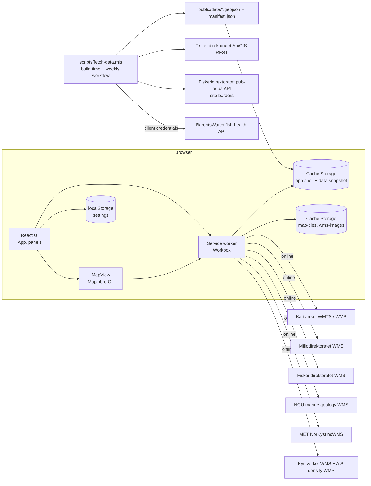
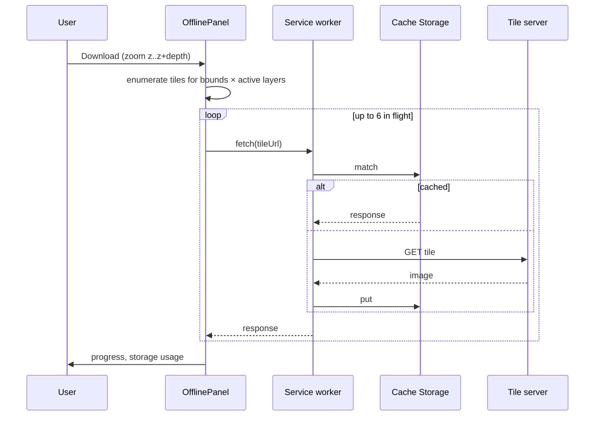

# AiMar architecture

_Updated 2026-09-14 (cases) — Phase 1 (offline-first PWA, no backend)_

## Overview

Phase 1 is a static web application. The browser talks directly to open
Norwegian map services; datasets that the browser cannot reach (no CORS or
token required) are snapshotted at build time and bundled with the app. A
service worker makes the app shell, bundled data and every viewed tile
available offline.

## Source layout (`web/src`)

| File | Responsibility |
|---|---|
| `main.tsx` | Boots React, points MapLibre at its bundled worker |
| `App.tsx` | Layout: header tabs, map, side panel, update toast |
| `components/MapView.tsx` | Builds a MapLibre style from the layer registry + settings, click/hover handling, persists view |
| `components/SettingsMenu.tsx` | Header dropdown with app settings (base map) |
| `components/LayerPanel.tsx` | Overlay tabs with checkboxes, legends, provenance per layer |
| `components/InspectPanel.tsx` | Locality register entry, or hypothetical-site neighbourhood summary |
| `components/CasesPanel.tsx` | Case histories for the filtered localities: search, kind chips, sorting, group-by-case, paged list (`lib/cases.ts` rows/sort/search/group) |
| `components/OfflinePanel.tsx` | Online state, install button, storage usage, area download, cache clearing, data snapshot provenance |
| `components/SearchBox.tsx` | Header search: name/number lookup, fly-to and select |
| `components/OperatorDropdown.tsx` | Floating operator filter on the map; drives MapLibre filters on localities and borders |
| `components/Hint.tsx` | Tooltip wrapper (hover / focus / tap) rendering an explanation from `lib/hints.ts` |
| `components/HoverInfo.tsx` | Pointer-following card: vector hits, decoded-tile density sampling, debounced WMS GetFeatureInfo per enabled overlay |
| `lib/featureInfo.ts` | GetFeatureInfo URL builder and response parsers (ncWMS XML, ArcGIS GeoJSON, MapServer text) |
| `components/HelpPanel.tsx` | In-app help |
| `components/UpdatePrompt.tsx` | "New version" / "ready offline" toast via `virtual:pwa-register/react`; polls `sw.js` every 10 min and on focus/online |
| `lib/layers.ts` | **Layer registry**: id, kind (xyz / wms / geojson), URL, organisation, licence, attribution, cache policy, category tab and per-tab importance order |
| `lib/settings.ts` | `localStorage`-backed settings store exposed through `useSyncExternalStore` |
| `lib/localities.ts` | Locality types, data loader, haversine neighbourhood features, search |
| `lib/filters.ts` | Multi-select field filters (register values incl. composite splitting, capacity and lice-statistic ranges) combined with the operator selection into a locality-number list for the map |
| `lib/i18n.ts`, `i18n/en.ts`, `i18n/nb.ts` | Two-language dictionaries with identical keys (tested), `useT()` hook and `t()` for non-React code, language persisted in localStorage |
| `lib/cases.ts` | eInnsyn case entries per locality, title classification, entry links |
| `lib/heatmap.ts`, `components/HeatmapLayer.tsx` | Client-computed treatment-intensity grid (kernel-weighted treatment/production weeks within R km) painted into a MapLibre image source on every move |
| `components/FieldPicker.tsx` | Checkbox popover of a field's values with counts, All toggle, A–Z/count sort and search |
| `lib/operatorColours.ts` | Fixed operator → colour table (all operators with ≥16 sites, appended only by `scripts/gen-operator-colours.mjs`) with rules for unlisted and selected operators; used by map dots, legend and charts |
| `lib/fishhealth.ts` | Fish-health snapshot types, per-locality lice series, 52-week summary, regional lice pressure, operator pressure series (1/d² weighted over reporting farms) |
| `components/LiceChart.tsx` | SVG lice time series: 0.5 limit line, fallow wash, treatment markers, hover readout, table view |
| `lib/offline.ts` | Online hook, tile enumeration for a bounding box, prefetch with concurrency, storage estimate, cache clearing |
| `lib/install.ts` | Captures `beforeinstallprompt` |
| `lib/cacheJanitor.ts` | Byte-limited LRU eviction across the runtime caches (overlays first, base tiles last) |
| `lib/tileFilters.ts` | Custom `aisalpha://` tile protocol: decodes density tiles and sets alpha from traffic rank (hue palette for MarTraf, distance-from-white for the 2022 layer) |
| `lib/__tests__/` | Vitest unit tests for tile maths, neighbourhood features and the settings store |

## Storage model

| Data | Store | Written by | Policy |
|---|---|---|---|
| App shell (JS/CSS/HTML/icons) and `public/data/*` | Workbox precache | Service worker install | Versioned per build; new version prompts reload |
| Kartverket tiles | Cache Storage `map-tiles` | Service worker runtime caching | Cache-first, 40 000 entries / 180 days; plus 300 decoded tiles per source in MapLibre's memory cache |
| WMS images and GetFeatureInfo answers (Kartverket, Miljødirektoratet, Fiskeridirektoratet, NGU, Kystverket, Kystdatahuset) | Cache Storage `wms-images` | Service worker runtime caching | Cache-first, 40 000 entries / 90 days |
| Climatology images (same origin, future) | Cache Storage `climatology` | Service worker runtime caching | Stale-while-revalidate, 500 entries / 1 year |
| NorKyst forecast images (MET thredds) | Cache Storage `forecast-images` | Service worker runtime caching | Cache-first, 3 000 entries / 1 day |
| Settings | `localStorage` key `aimar.settings.v1` | `lib/settings.ts` | Never evicted with caches |
| Per-site time series (future) | IndexedDB | Phase 2 | Per locality, explicit refresh |

A byte limit (default 20 GB, `cacheLimitGb` in settings) is enforced by
`lib/cacheJanitor.ts`: it reads Workbox's per-entry last-used timestamps from
IndexedDB and deletes least-recently-used entries — every non-base cache
first, `map-tiles` last — until `navigator.storage.estimate()` is under 90 %
of the limit. It runs 30 s after start-up and every 10 minutes.

The "Download this area" action simply fetches every tile URL for the active
layers over the current bounds and zoom range; the service worker's runtime
caching stores the responses, so prefetch and normal browsing share one cache.

## Rendering

`MapView.buildStyle` turns the registry + settings into a MapLibre style:
raster sources for XYZ and WMS (WMS uses a `{bbox-epsg-3857}` tile template),
GeoJSON sources drawn as circles (localities, coloured by species, plus a
highlight layer filtered on the selected locality number) or as fill + outline
(site borders). Clicking a border resolves its locality number to the bundled
locality record. Settings changes call
`setStyle(..., { diff: true })` so only changed layers are touched.

Two MapLibre 6 details matter under Vite: the worker must be registered with
`setWorkerUrl` using a `?worker&url` import, and GeoJSON `data` URLs must be
absolute because they are fetched from that worker.

## Build-time data snapshot

`scripts/fetch-data.mjs` queries the Fiskeridirektoratet ArcGIS REST layer
`akvakultur_lokaliteter` (1781 active localities) as GeoJSON, then fetches each
site's border polygon from the pub-aqua API (`/sites/{siteNr}/borders`, two
workers, backing off on HTTP 429). It rounds coordinates to 6 decimals and
writes `localities.geojson`, `site_polygons.geojson` and a `manifest.json` with
retrieval timestamp, source URL, licence and feature counts. The service worker
precaches all three, so they are available on first offline start. The
`refresh-data` workflow runs the script weekly and commits + redeploys when the
data changed.

`scripts/fetch-fishhealth.mjs` obtains a BarentsWatch token with client
credentials (from `web/.env.local` locally, repository secrets in CI), then
calls `fishhealth/locality/{year}/{week}` once per ISO week from 2012 (start of
weekly reporting) to the last complete week. It writes `fishhealth.json`: the week labels
plus, per locality, an array of adult-female-lice values and an array of flag
bitmasks (reported, fallow, mechanical removal, substance treatment, cleaner
fish, PD, ILA). Localities without any report are dropped. The file is
precached with the rest of the data.

`scripts/fetch-cases.mjs` harvests eInnsyn (`api.einnsyn.no/search`, no key
needed for reading) for journal entries about aquaculture cases over the last
three years. Entries are matched to localities by title (locality number, or a
site name of at least five characters; municipality-named sites only when
written as "lokalitet NAME"). Every matched case file is then completed from
`/saksmappe/{id}/journalpost`, so the whole paper trail of a case belongs to
its site. Runs are incremental (`oppdatertDatoFrom` since the previous
snapshot); `--full` re-harvests and `--rematch` re-runs matching offline. It
writes `cases.json`: entries (date, authority, direction, title, archive
identifiers for the einnsyn.no link), a case map (number, title) and the
locality → entry index. Precached like the other data files.

`scripts/fetch-seatemp.mjs` pulls the farm-reported weekly sea temperature
(`fishhealth/locality/{loknr}/seatemperature/{year}`) for every site since
2012 into `seatemp.json` on the fishhealth week index, checkpointing every 200
requests; completed past years are recorded in `done` and skipped on rerun, the
current year is refreshed. `scripts/fetch-tides.mjs` asks Kartverket's tide API
for one year of predicted high/low waters at each site (nearest gauge plus local
factor) and stores mean/max range and mean high/low water in `tides.json`;
sites already present are skipped. `lib/siteData.ts` loads both optionally.

`scripts/fetch-docs.mjs` looks up the entries of `cases.json` in batches of
100 (`/search?ids=…&expand=dokumentbeskrivelse.dokumentobjekt`), downloads
every published file from `/dokumentobjekt/{id}/download` into `DOCS_DIR`
(scratch by default; `/media/pc/ext4TB/AiMar/docs/einnsyn` locally), extracts
the first 500 characters with `pdftotext` and writes `docs.json` (entry id →
documents with title, format, size, excerpt). Incremental: entries already
looked up are skipped. The app links the file on the eInnsyn API.

## Testing

`npm test` runs Vitest unit tests for the pure modules (tile enumeration and
URLs, haversine/neighbourhood features, settings persistence).
`scripts/smoke.mjs` drives headless Chrome against the preview build: map
load, tile requests, service-worker activation, tiles in Cache Storage,
click-to-inspect, settings persistence, and an offline reload that must render
tiles from cache.

## Later phases

Phases 2+ add the Python/FastAPI feature engine, PostGIS, NorKyst statistics,
connectivity modelling and per-site time series (cached in IndexedDB). The
layer registry and cache policies are designed so those services plug in as
additional entries rather than code changes in the map.
